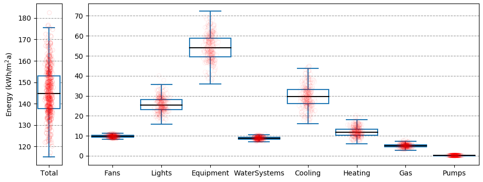
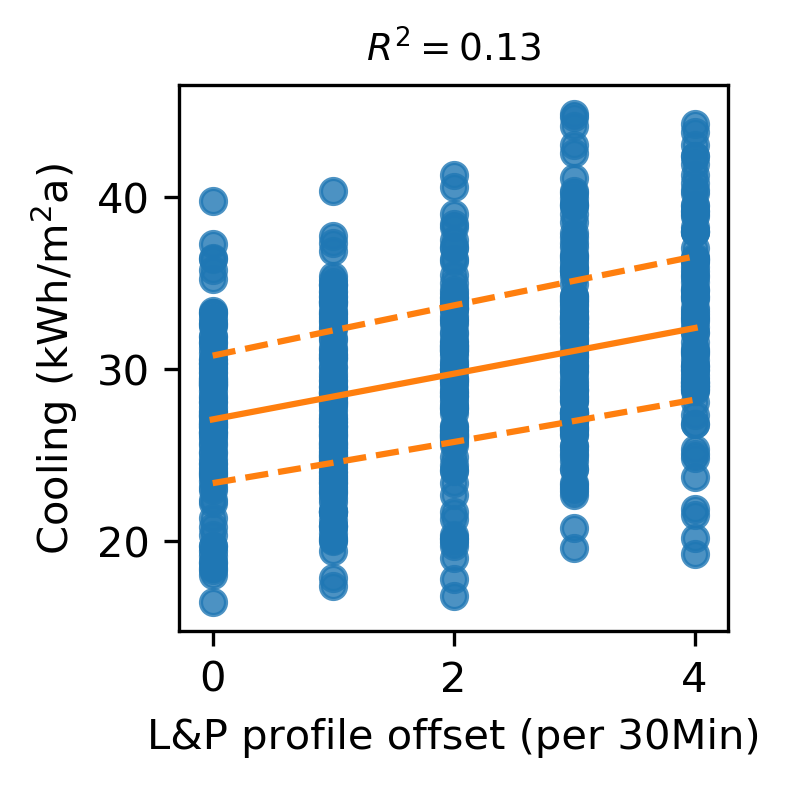
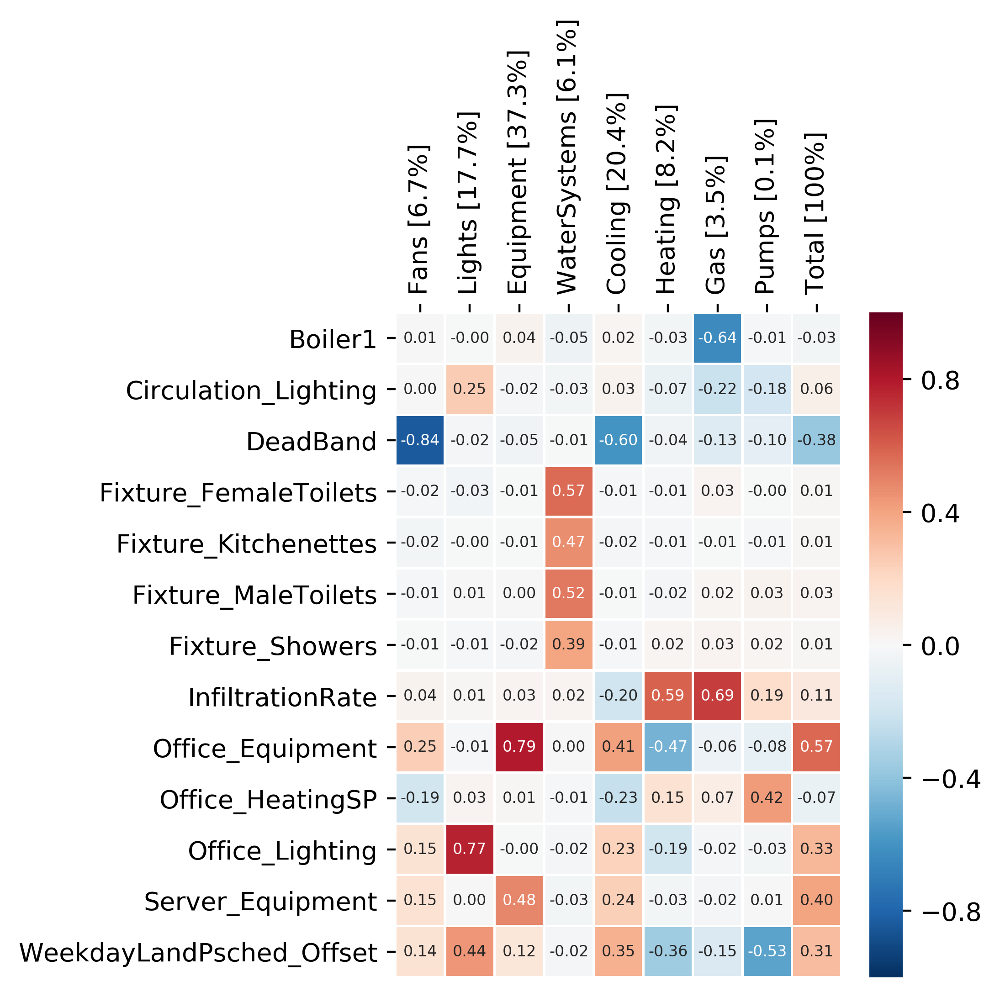
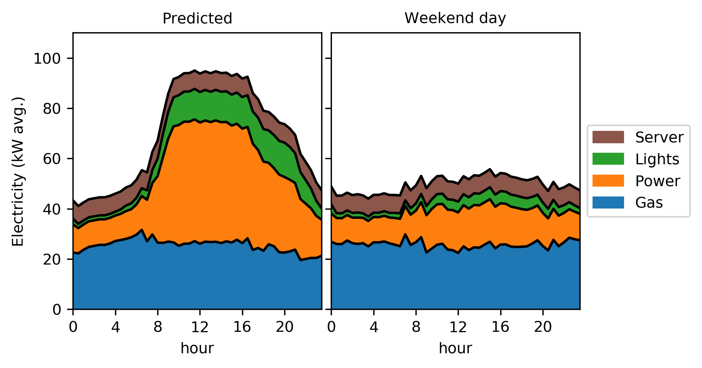
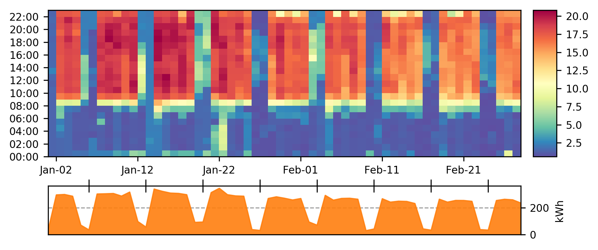
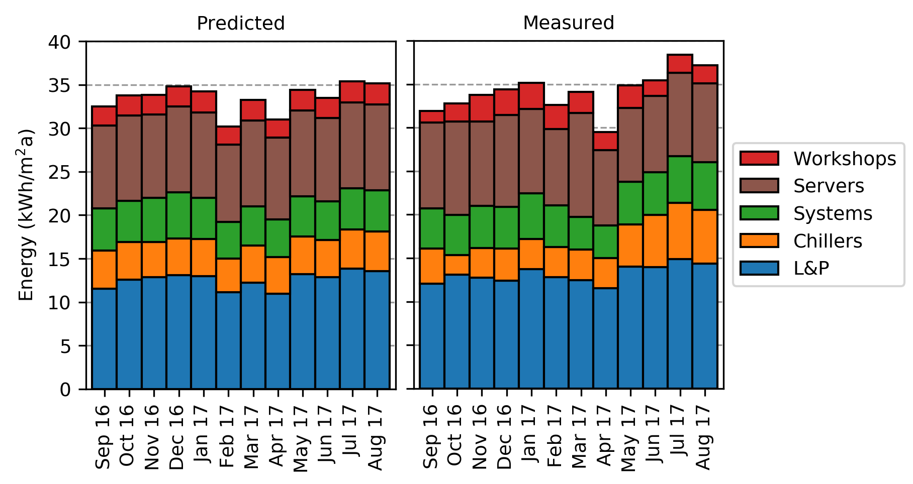

# parametric-simulation-energyplus
Parametric building performance simulation using Python for EnergyPlus

## __create_idfs.py__

Copies and manipulates existing .idf files for Monte Carlo simulation (i.e. uses random sampling techniques to create multiple .idf files to then be run in EnergyPlus).

### dir data_files

Store .csv files in here for the variable parameters with their defined mean and standard deviations.

- equipment_props.csv (static parameters for equipment, lighting, system variables, etc.)
- mat_props.csv (materials)
- house_scheds.csv (schedules)

### dir IDFs

This is where the `.idf` files are stored.

## __read_predictions.py__

Reads eplusmtr.csv files and combines them in a dataframe. These can then be saved as a .hdf file for quicker loading.

## __read_measurement.py__

Project specific. This will read measurement data from .csv files extracted from sub-metering systems, short-term monitoring and gas meters.

## __sensitivity_analysis.py__

Perform sensitivity analysis on the predictions, uses the read_predictions to get the eplusmtr.csv results and correlates these with the input parameters generated during random sampling.

<figure>

</figure>

<figure>

</figure>

<figure>

</figure>

## __compare_timeseries_datasets.py__

Script to visualise and compare two datasets, in particular in this case predicted and measured energy use.

<figure>

</figure>

<figure>

</figure>

<figure>

</figure>